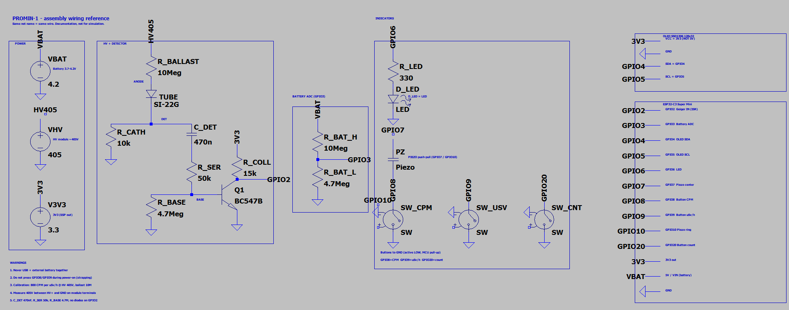
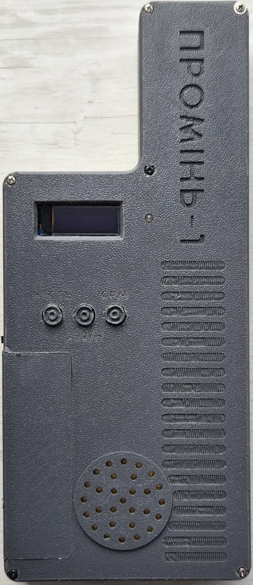
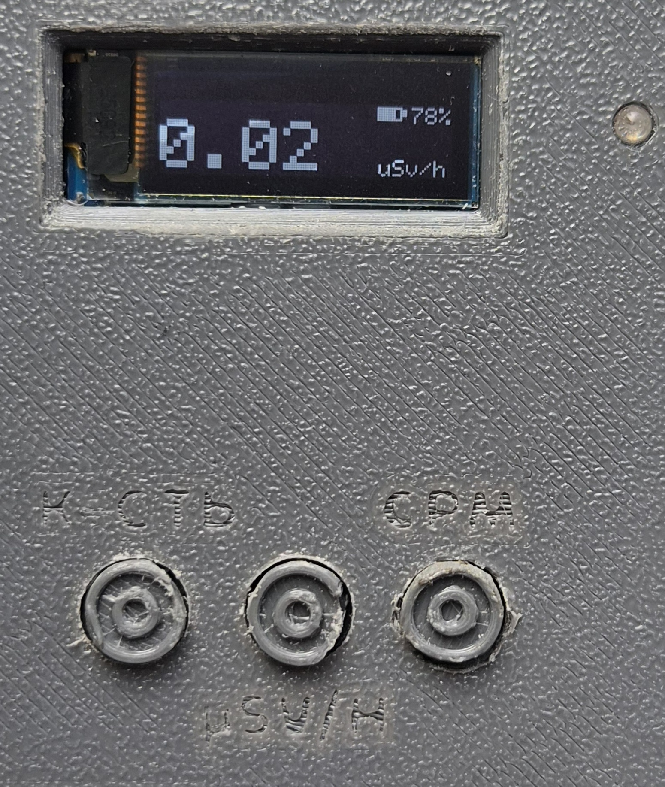
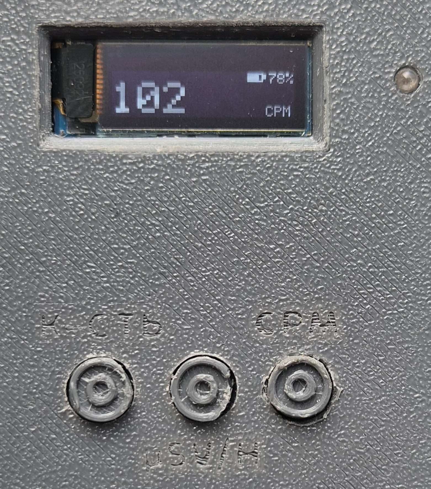
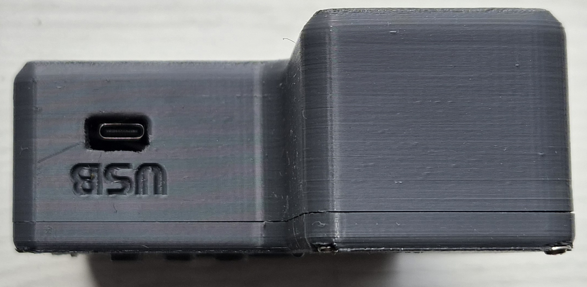
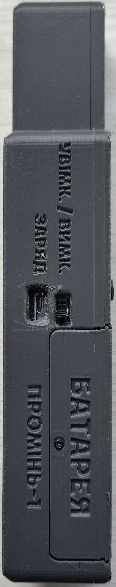
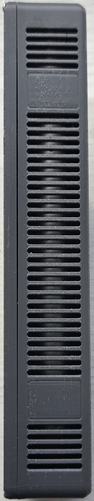

# Promin-1 — SI-22G gamma dosimeter / Промінь-1 — γ-дозиметр на СІ-22Г

[🇺🇦 Українська](README.md) | **🇬🇧 English**

A portable DIY gamma dosimeter based on the **SI-22G** Geiger–Müller tube and an
**ESP32-C3 Super Mini** microcontroller.

> ⚠️ **Hobby project.** This is NOT a certified or reference-calibrated
> radiation safety instrument. Do not rely on it for health or safety
> decisions. Made *only for fun*.

## 🎬 Demo

<video src="https://github.com/dark-node/Dosimeter-Radiometer.-Promin-1.-DIY-Project.-Based-on-the-ESP32-C3-mini-and-SI-22G/raw/main/media/demo-test.mp4" controls width="640" poster="media/photos-final/front-view.jpg">
  Your browser does not support embedded video.
</video>

📹 If the video does not play here — [open / download the test video](media/demo-test.mp4)

---

## Features

- Tube pulse capture via hardware interrupt (GPIO ISR).
- **CPM** calculation (60 s and 10 s windows) and dose rate in **µSv/h**.
- OLED SSD1306 128×32 display, three modes: `µSv/h`, `CPM`, `cnt`.
- Audible click (piezo) and LED flash on every pulse.
- Battery level indication (resistive divider, polled every 2 min).
- Boot splash screen (2 s).

## Specifications

| Parameter | Value |
|---|---|
| Tube | SI-22G (gamma) |
| High voltage | ~405 V (off-the-shelf DC-DC module) |
| Anode ballast | 10 MΩ |
| Pulse pickup | from cathode, BC547B shaper → GPIO2 |
| Calibration | 800 CPM per 1 µSv/h |
| Background | ≈0.10–0.12 µSv/h |
| MCU | ESP32-C3 Super Mini |
| Display | OLED SSD1306 128×32, I2C 400 kHz |
| Power | Li-ion 18650 |

Full description, build history and BOM — in [`docs/Description.txt`](docs/Description.txt) (Ukrainian).

## GPIO pinout (ESP32-C3)

| GPIO | Function |
|---|---|
| 2 | SI-22G pulse input (ISR) |
| 3 | Battery ADC |
| 4 / 5 | OLED SDA / SCL |
| 6 | LED (via 330 Ω) |
| 7 / 10 | Piezo (push-pull) |
| 8 / 9 / 20 | Buttons: CPM / µSv·h / counter |
| 3V3 | OLED power (NOT 5 V) |

Detector schematic:

```
HV+ ──[10M]── SI-22G anode ── cathode ── DET
DET ──[10k]── GND
DET ──[470nF]──[50k]── BC547B base ──[4.7M]── GND
emitter ── GND
collector ──[15k]── 3V3,  tap → GPIO2
```

> ⚡ Do not use GPIO0, GPIO1, GPIO21 (boot/UART).
> Common ground: ESP, HV module, tube cathode, transistor emitter.

## Repository structure

```
.
├── firmware/             # ESP-IDF firmware (C/C++)
│   └── main/main.cpp
├── hardware/
│   ├── schematics/       # LTspice: wiring + simulations
│   └── 3d-models/        # Enclosure STL/Blender + renders/
├── media/
│   ├── photos-final/     # Photos of the finished device
│   ├── photos-build/     # Build process photos
│   └── demo-test.mp4     # Test/demo video
├── docs/
│   ├── Description.txt    # Description, history, BOM, spec (UA)
│   └── splash.png         # OLED splash source image
├── LICENSE               # MIT
├── README.md             # Ukrainian
└── README.en.md          # English (this file)
```

## Build & flash

Requires [ESP-IDF](https://docs.espressif.com/projects/esp-idf/). In `firmware/`:

```bash
idf.py set-target esp32c3
idf.py build
idf.py flash monitor
```

## Schematic (LTspice)

File [`hardware/schematics/promin1-connections.asc`](hardware/schematics/promin1-connections.asc)
— assembly wiring reference (documentation, not for simulation).



## Gallery

| | | |
|---|---|---|
|  |  |  |
|  |  |  |

Enclosure 3D models: [`hardware/3d-models/`](hardware/3d-models/)

## License

[MIT](LICENSE). Hobby device, use at your own risk.
